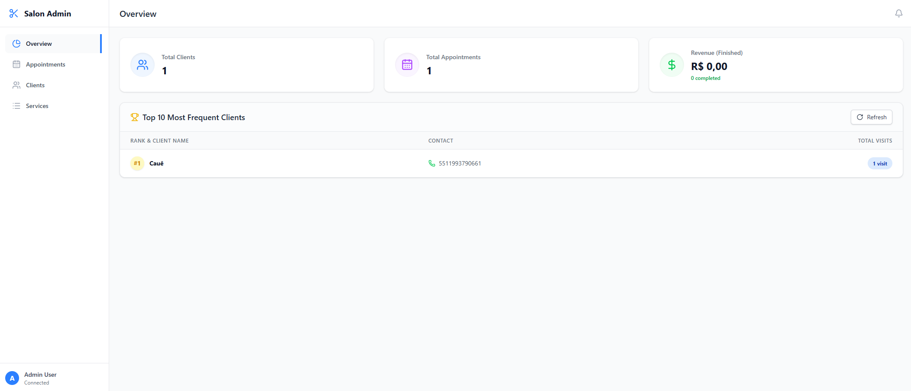
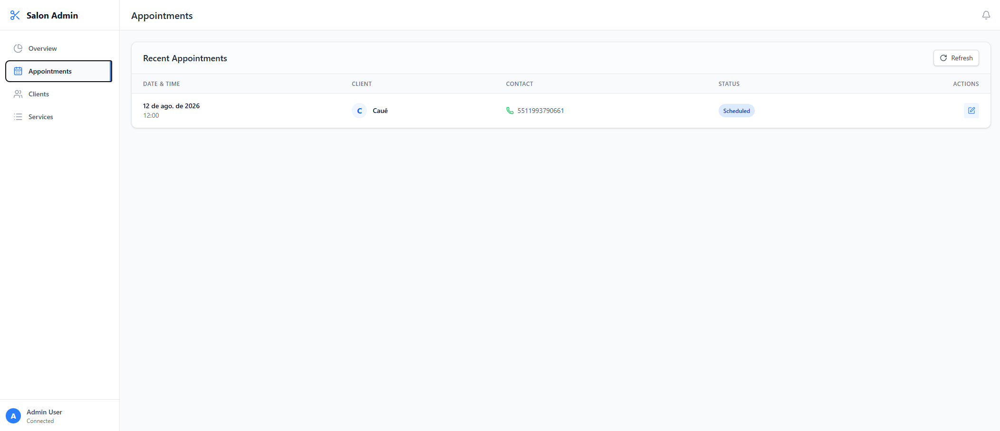
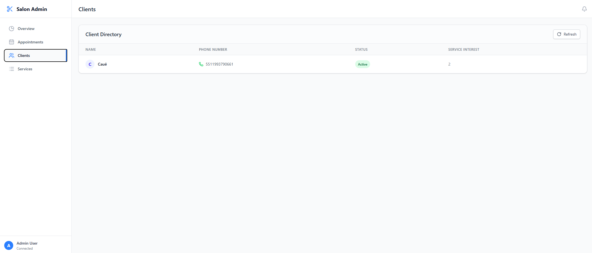
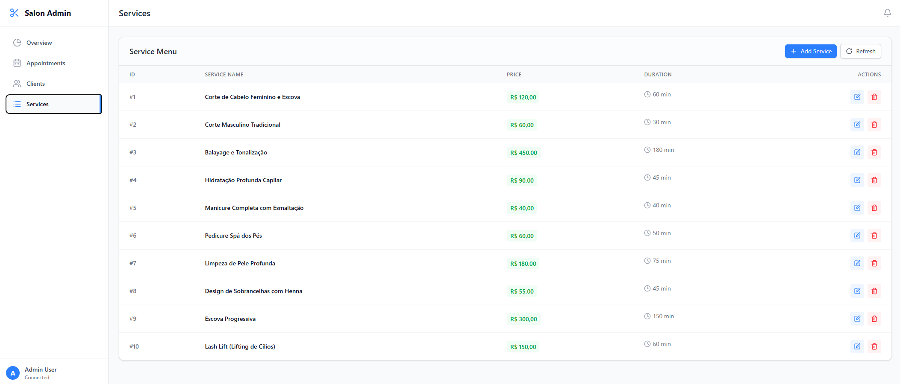

# 💇‍♀️ Salon Admin Dashboard (React + TypeScript)

A modern, responsive, single-page web application (SPA) built to manage salon operations. This dashboard acts as a central command center, working alongside an automated WhatsApp scheduling assistant powered by n8n and OpenAI.

---

## 🌟 Features

- **📊 Overview Dashboard:** Real-time KPIs (Total Clients, Total Appointments) and a "Top 10" Leaderboard of frequent clients.
- **📅 Appointment Management:** View all appointments, edit client details, adjust scheduling times, and update statuses with visual badges.
- **👥 Client Directory:** View all captured clients and quickly identify those flagged for human support.
- **📋 Service Menu (CRUD):** Add, Edit, and Delete salon services. Safely handles currency in cents.

---

## 🛠️ Tech Stack

- **Frontend Framework:** React 18
- **Language:** TypeScript
- **Styling:** Tailwind CSS
- **Icons:** lucide-react
- **Backend/Database:** Supabase (PostgreSQL)

## 🖼️ Dashboard Images

